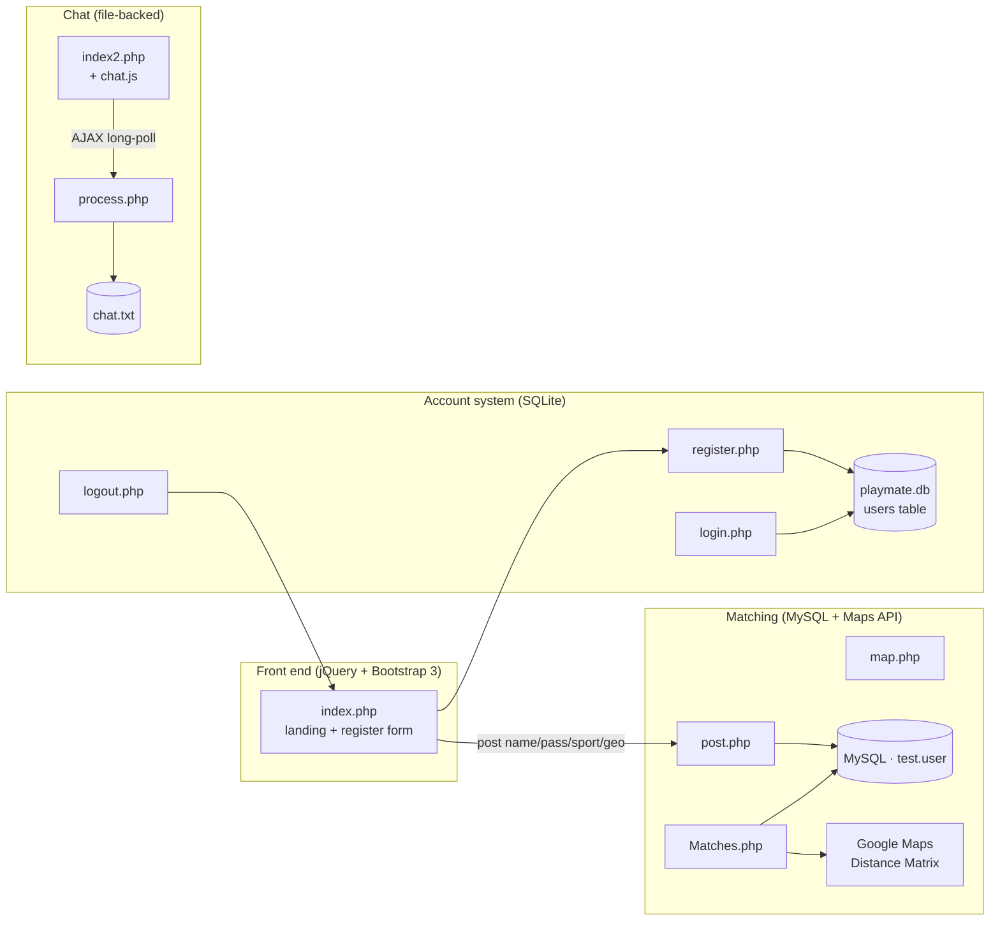

# PlayMate


**Search. Meet. Play.** — a web app for finding people near you who want to play the same sport.

PlayMate matches you with sport partners in your locality. Sign up, share your
location, and see other players around you with the distance and travel time to
reach them. When you find someone, jump into the built-in chatroom to plan a
game. It was originally built at AngelHack 2016 around a three-step loop:
**Search** for players near you, **Meet** them, then go **Play**.

The app is a classic LAMP-style codebase: PHP served by the built-in web server,
SQLite for accounts, jQuery + Bootstrap 3 for the front end, and a file-backed
chat engine. No build step, no frameworks.

---

## ✨ Features

- **Location-based matching** — register with a sport and your geolocation; nearby players are ranked by distance and travel time (via the Google Maps Distance Matrix API).
- **Account system** — register, log in, and log out with bcrypt-hashed passwords (`password_hash` / `password_verify`), session regeneration on login, and per-session CSRF tokens.
- **Zero-config SQLite** — the `users` table is created automatically in `playmate.db` on first run; no external database is required for accounts.
- **Built-in chatroom** — a lightweight, file-backed chat (`chat.txt` + `process.php`) with long-polling updates and link auto-detection.
- **Landing page** — a Bootstrap 3 "Freelancer" theme explaining the Search → Meet → Play flow, with modal walkthroughs.
- **Sport selection** — Football, Basketball, and Cricket out of the box.

## 📦 Installation

**Prerequisites**

- PHP **7.0 or newer** (the auth code uses `random_bytes()`, added in PHP 7.0).
- The `pdo_sqlite` extension (enabled in most default PHP builds).
- To use the **matching** view (`Matches.php`), you also need a MySQL server and a Google Maps API key — see [Configuration](#-configuration).

**Steps**

```bash
# 1. Clone the repository
git clone https://github.com/<owner>/PlayMate.git
cd PlayMate

# 2. Start the built-in PHP server
php -S localhost:8000
```

Then open <http://localhost:8000/> in your browser. The `playmate.db` SQLite
file is created automatically the first time an account-related page loads.

> [!NOTE]
> There is no `composer.json`, `package.json`, or build step — everything runs
> from the source tree as-is.

## 🚀 Usage

Open the landing page and walk the loop:

```text
http://localhost:8000/            → landing page (Search · Meet · Play)
http://localhost:8000/register.php → create an account
http://localhost:8000/login.php    → sign in
http://localhost:8000/Matches.php  → see nearby players (needs MySQL + Maps key)
http://localhost:8000/index2.php   → the PlayMate chatroom
```

**Minimal run (accounts + chat, zero extra setup):**

1. Start the server with `php -S localhost:8000`.
2. Visit `/register.php`, create a user, then log in at `/login.php`.
3. The navbar now shows `Logout (<username>)` — session auth is active.
4. Open `/index2.php`, enter a chat name, and send messages.

**Matching view (`Matches.php`)** renders a gallery of nearby players with their
distance and travel time, each with a **Chat** button that opens the chatroom.

## ⚙️ Configuration

There are no environment variables or CLI flags. All settings live as constants
in the source. Edit these files to point PlayMate at your own resources:

| Setting | File | Default | Notes |
|---|---|---|---|
| SQLite DB path | `db.php` | `playmate.db` (project root) | Auto-created on first use |
| MySQL host / user / pass / db | `Matches.php`, `map.php`, `post.php` | `localhost` / `root` / *(empty)* / `test` | Used only by the matching view |
| Google Maps API key | `Matches.php`, `map.php` | *(hardcoded demo key)* | **Replace with your own key** — see warning below |
| Contact-form recipient | `mail/contact_me.php` | `yourname@yourdomain.com` | Used by the contact form handler |

> [!WARNING]
> `Matches.php` and `map.php` ship with **hardcoded demo API keys** (Google Maps
> Distance Matrix, and the legacy HPE Haven OnDemand MapCoordinates service).
> The Haven OnDemand service has been retired and those calls will fail today.
> Supply your own Google Maps key and swap or remove the Haven OnDemand lookup
> before relying on the matching view. The SQLite account system and the
> chatroom do **not** depend on any external API and work offline.

## 🧱 How it works



Two independent data paths live side by side:

- **Accounts** — `db.php` opens a PDO/SQLite connection and creates the `users`
  table (`id`, `username`, `password`) if it does not exist. Passwords are hashed
  with `password_hash(..., PASSWORD_DEFAULT)` and verified with
  `password_verify()`. Sessions are regenerated on successful login, and each
  form post is guarded by a random CSRF token.
- **Matching** — the original hackathon flow (`Matches.php`, `post.php`,
  `map.php`) stores players in MySQL and calls the Google Maps Distance Matrix
  API to compute distance and travel time between coordinates. This path needs
  the extra setup described in [Configuration](#-configuration).

The chatroom (`index2.php` + `chat.js` → `process.php`) is Kenrick Beckett's
file-based chat engine: messages are appended to `chat.txt`, and the client
long-polls `process.php` every second for new lines. It needs no database.

## 📁 Project layout

```text
index.php          Landing page (Search · Meet · Play) + registration form
index2.php         Chatroom UI
register.php       Sign-up (SQLite, bcrypt, CSRF token)
login.php          Sign-in (session regeneration, password_verify)
logout.php         Destroy session, redirect home
db.php             SQLite connection + users-table bootstrap
Matches.php        Nearby-players view (MySQL + Google Maps API)
post.php           Insert a player into MySQL (legacy)
map.php            Distance/duration lookup (legacy)
process.php        Chat backend (file-based long-polling)
chat.js            Chat client (jQuery AJAX)
mail/contact_me.php  Contact-form email handler
css/ js/ fonts/ font-awesome/ less/   Front-end assets and LESS sources
```

## 🤝 Contributing

This is a small legacy hackathon project. To contribute, fork the repository,
make your change on a branch, and open a pull request describing what you
changed and why. Please avoid committing real API keys — add placeholders and
document them in [Configuration](#-configuration).

## 📄 License

Licensed under the **Apache License, Version 2.0** (`SPDX-License-Identifier:
Apache-2.0`). See [`LICENSE`](./LICENSE) for the full text.

PlayMate was originally built at AngelHack 2016 by Team Lunatic Fringe. The
front-end theme is based on Start Bootstrap's "Freelancer" template.
